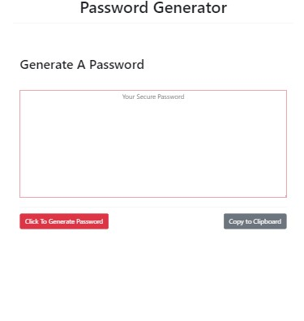
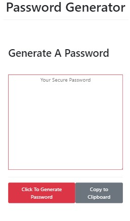

# Password Generator

**Motivation**

This is a password generator that I built for a project in the UCSD web development bootcamp program. The goal of the password generator is to give a user the option to choose which characters they would like to include in their password, such as numbers, uppercase letters or special characters, as well as the length of the password. The user can then copy the newly generated password to their clipboard. The application runs on JavaScript and uses Bootstrap to provide styling and responsiveness.

**Build status**

The build status is complete.

**Code style**

The application uses standard HTML markup style and Bootstrap CSS for styling and responsiveness. The program is written in JavaScript. Comments and descriptions have been added to the code to make it clear for other developers the purpose of each function. I tried to reduce code complexity by breaking down processes into multiple, short and simple functions.

**Screenshots**

Here are two screenshots of the application.

_Web version_



_Mobile version_



**Code Example**

```javascript
//This function generates the password once the user criteria has been met.
function generatePassword(validPasswordCharacters, passwordLength) {
  let password = "";
  for (let i = 0; i < passwordLength; ++i) {
    password +=
      validPasswordCharacters[
        Math.floor(Math.random() * validPasswordCharacters.length)
      ];
  }
  return password;
}
```

**Installation**

No installation necessary. Project is hosted here:
